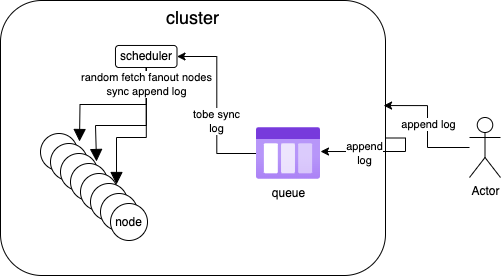

## 1、WGossip是什么？

一个gossip协议的MVP（最小可行）实现，仅供个人学习与交流。

## 2、效果展示

运行`com.wentry.wgossip.example.Test`类：

1. 测试代码如下：

   - ```java
     public class Test {
         public static void main(String[] args) {
             //20个节点，每次同步5个
             GossipCluster cluster = new GossipCluster(20, 5);
     
     
             cluster.put("key", "1");
             cluster.put("key", "2");
             cluster.put("key", "3");
             cluster.put("key", "4");
             cluster.put("key", "5");
             cluster.put("key", "6");
     
             System.out.println(LogUtils.wrapTimeLog("赋值结束，数据同步中..."));
     
             //启动一个线程在同步完成之前读取，这里的key肯定是不一致的，
             Executors.newScheduledThreadPool(1).scheduleAtFixedRate(new Runnable() {
                 @Override
                 public void run() {
                     System.out.println(LogUtils.wrapTimeLog("当前集群对外提供的值是：" + cluster.get("key")));
                 }
             }, 1, 1, TimeUnit.SECONDS);
     
             cluster.waitSync();
     
             List<INode> nodes = cluster.getNodes();
     
             System.out.println(LogUtils.wrapTimeLog("同步完毕，开始校验各个节点获取的值是否一致..."));
             for (INode node : nodes) {
                 System.out.println(LogUtils.wrapTimeLog("node:" + node + ", key:" + node.get("key")));
             }
             System.out.println(LogUtils.wrapTimeLog("检验完毕"));
     
         }
     }
     ```

2. clusterSize=20，fanout=5

3. 集群不断写入6个数据，等待同步完成

4. 日志输出如下：

   - ```bash
     2024-08-10 15:27:06 : 赋值结束，数据同步中...
     2024-08-10 15:27:07 : 当前集群对外提供的值是：1
     2024-08-10 15:27:08 : 当前集群对外提供的值是：2
     2024-08-10 15:27:09 : 当前集群对外提供的值是：3
     2024-08-10 15:27:10 : 当前集群对外提供的值是：4
     2024-08-10 15:27:11 : 当前集群对外提供的值是：4
     2024-08-10 15:27:12 : 当前集群对外提供的值是：5
     2024-08-10 15:27:13 : 当前集群对外提供的值是：6
     2024-08-10 15:27:13 : 同步完毕，开始校验各个节点获取的值是否一致...
     2024-08-10 15:27:13 : node:com.wentry.wgossip.impl.BaseNode@7f8632b5, key:6
     2024-08-10 15:27:13 : node:com.wentry.wgossip.impl.BaseNode@2596af00, key:6
     2024-08-10 15:27:13 : node:com.wentry.wgossip.impl.BaseNode@48c5782b, key:6
     2024-08-10 15:27:13 : node:com.wentry.wgossip.impl.BaseNode@1d170264, key:6
     2024-08-10 15:27:13 : node:com.wentry.wgossip.impl.BaseNode@2c82da41, key:6
     2024-08-10 15:27:13 : node:com.wentry.wgossip.impl.BaseNode@58f956f2, key:6
     2024-08-10 15:27:13 : node:com.wentry.wgossip.impl.BaseNode@475280a4, key:6
     2024-08-10 15:27:13 : node:com.wentry.wgossip.impl.BaseNode@3b9e79e6, key:6
     2024-08-10 15:27:13 : node:com.wentry.wgossip.impl.BaseNode@9f01dac, key:6
     2024-08-10 15:27:13 : node:com.wentry.wgossip.impl.BaseNode@2cd12ad4, key:6
     2024-08-10 15:27:13 : node:com.wentry.wgossip.impl.BaseNode@4f60318b, key:6
     2024-08-10 15:27:13 : node:com.wentry.wgossip.impl.BaseNode@54641ddb, key:6
     2024-08-10 15:27:13 : node:com.wentry.wgossip.impl.BaseNode@7403a48b, key:6
     2024-08-10 15:27:13 : node:com.wentry.wgossip.impl.BaseNode@797680d3, key:6
     2024-08-10 15:27:13 : node:com.wentry.wgossip.impl.BaseNode@19597f9c, key:6
     2024-08-10 15:27:13 : node:com.wentry.wgossip.impl.BaseNode@3c741939, key:6
     2024-08-10 15:27:13 : node:com.wentry.wgossip.impl.BaseNode@4ee92fc5, key:6
     2024-08-10 15:27:13 : node:com.wentry.wgossip.impl.BaseNode@2c3dbb8e, key:6
     2024-08-10 15:27:13 : node:com.wentry.wgossip.impl.BaseNode@fcb99f2, key:6
     2024-08-10 15:27:13 : node:com.wentry.wgossip.impl.BaseNode@34b6ec, key:6
     2024-08-10 15:27:13 : 检验完毕
     ```

## 3、基本原理

其原理简图如下，本质就是收敛的随机算法，通过调度器随机抽取节点进行通知，由于算法是收敛的，数据最终会达到一致状态。




具备以下几个特性：

1. 每个节点具有全量的数据
2. 数据以日志的方式被记录
3. 日志具有递增的id，以用于区分先后顺序
4. 数据存储在本地，只是用于简单demo
5. 此实现没有去中心化，通过一个cluster作为门面
6. 核心类有以下几个：
   -  [ICluster.java](src/main/java/com/wentry/wgossip/ICluster.java)  [ILogAppender.java](src/main/java/com/wentry/wgossip/ILogAppender.java)  [INode.java](src/main/java/com/wentry/wgossip/INode.java)  [IStorage.java](src/main/java/com/wentry/wgossip/IStorage.java) 
7. gossip的动画演示可以参照：https://flopezluis.github.io/gossip-simulator/


**注意：**

1. fanout的值`>`1且`<=`clusterSize

2. 每条日志的平均同步次数：

3. $$
   r = \log_f c
   $$

4. 其中： f = fanout  ，c = clusterSize ， 如：fanout=5，clusterSize=20， log-5-20 ≈ 1.86

   

